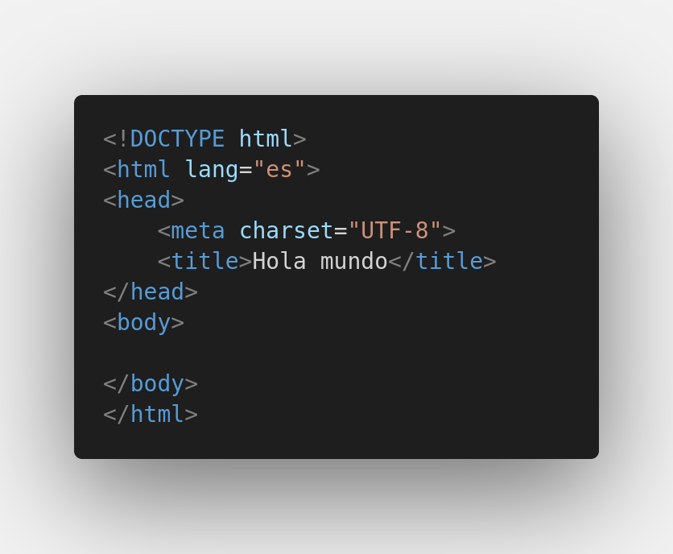

# HTML

Por su significado en inglés **HyperText Markup Language** (*lenguaje de marcado de hipertexto*). Define el significado y estructura del contenido web.

- ## Document type declaration (*DTD*)

Es una **declaración** no una ~~etiqueta~~, que ayuda al navegador a determinar que versión de html se usó para escribir el documento.

```<!DOCTYPE>```

- ## Root

Etiqueta raiz para envolver todo el contenido de la página.

```<html>...</html>```

- ## head

Etiqueta que funciona como un contenedor para todos los parámetros que quieras incluir en el documento **html**, como palabras clave, descripción de la página, hojas de estilo y declaración de codificación de caracteres.

```<head>...</head>```

- ## meta

Etiqueta que indica que codificación utilizará para gestionar contenido textual del documento.

###### Ejemplo: UTF-8 que incluye la mayoria de caracteres de todos los idiomas humanos escritos

```<meta charset="UTF-8">```

- ## title

Etiqueta que establece el título de la página, y los muestra en la pestaña del navegador.

```<title>...</title>```


- ## body

Contiene todo el contenido que quieres mostrar a los usuarios, como imágenes, videos, juegos, audios, etc.

- # Estructura general de un documento

