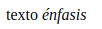

# text formatting

- ## p *(párrafo)* | Crea una caja en bloque | [Documentación mdn](https://developer.mozilla.org/es/docs/Web/HTML/Element/p)

    ```html
    <p>...</p>
    ```

- ## strong *(Especial énfasis)* | Crea una caja en línea | [Documentación mdn](https://developer.mozilla.org/es/docs/Web/HTML/Element/strong)

    ```html
    <strong>...</strong>
    ```

    

- ## b *(Negrita)* | Crea una caja en línea | [Documentación mdn](https://developer.mozilla.org/es/docs/Web/HTML/Element/b)

    ```html
    <b>...</b>
    ```

    

- ## em *(Énfasis)* | [Documentación mdn](https://developer.mozilla.org/es/docs/Web/HTML/Element/em)

    ```html
    <em>...</em>
    ```

    

- ## i *(Cursiva)* | Crea una caja en línea | [Documentación mdn](https://developer.mozilla.org/es/docs/Web/HTML/Element/i)

    ```html
    <i>...</i>
    ```

    

- ## tt *(Fuente de ancho fijo)* | Crea una caja en línea | [Documentación mdn](https://developer.mozilla.org/es/docs/Web/HTML/Element/tt)

    ```html
    <tt>...</tt>
    ```

    

- ## strike *(Tachado)* | Crea una caja en línea | [Documentación mdn](https://developer.mozilla.org/es/docs/Web/HTML/Element/strike)

    ```html
    <strike>...</strike>
    ```

    

- ## cite *(Cita - referencia a una fuente)* | Crea una caja en línea | [Documentación mdn](https://developer.mozilla.org/es/docs/Web/HTML/Element/cite)

    ```html
    <cite>...</cite>
    ```

    

- ## pre *(Texto preformateado - los espacios son mostrados como están escritos)* | Crea una caja en bloque | [Documentación mdn](https://developer.mozilla.org/es/docs/Web/HTML/Element/pre)

    ```html
    <pre>...</pre>
    ```

    

- ## del *(Marca las partes sustituidas)* | Crea una caja en línea o bloque | [Documentación mdn](https://developer.mozilla.org/es/docs/Web/HTML/Element/del)

    ```html
    <del>...</del>
    ```

    

- ## ins *(Marca las partes insertadas)* | Crea una caja en línea o bloque | [Documentación mdn](https://developer.mozilla.org/es/docs/Web/HTML/Element/ins)

    ```html
    <ins>...</ins>
    ```

    

- ## blockquote *(Cita en bloque)* | Crea una caja en bloque | [Documentación mdn](https://developer.mozilla.org/es/docs/Web/HTML/Element/blockquote)

    ```html
    <blockquote>...</blockquote>
    ```

    

- ## q *(Cita corta)* | Crea una caja en línea | [Documentación mdn](https://developer.mozilla.org/es/docs/Web/HTML/Element/q)

    ```html
    <q>...</q>
    ```

    

- ## abbr *(Abreviación)* | [Documentación mdn](https://developer.mozilla.org/es/docs/Web/HTML/Element/abbr)

    ```html
    <abbr>...</abbr>
    ```

    

- ## acronym *(Acrónimo)* | Crea una caja en línea | [Documentación mdn](https://developer.mozilla.org/es/docs/Web/HTML/Element/acronym)

    ```html
    <acronym>...</acronym>
    ```

    

- ## address *(Aporta información de contacto)* | Crea una caja en bloque | [Documentación mdn](https://developer.mozilla.org/es/docs/Web/HTML/Element/address)

    ```html
    <address>...</address>
    ```

    

- ## dfn *(Marca el término a definir)* | Crea una caja en línea | [Documentación mdn](https://developer.mozilla.org/es/docs/Web/HTML/Element/dfn)

    ```html
    <dfn>...</dfn>
    ```

    

- ## code *(Código)* | Crea una caja en línea | [Documentación mdn](https://developer.mozilla.org/es/docs/Web/HTML/Element/code)

    ```html
    <code>...</code>
    ```

    

- ## font *(Fuente)* | Crea una caja en línea | [Documentación mdn](https://developer.mozilla.org/es/docs/Web/HTML/Element/font)

    ```html
    <font>...</font>
    ```

    

- ## sub *(Subíndice)* | [Documentación mdn](https://developer.mozilla.org/es/docs/Web/HTML/Element/sub)

    ```html
    <sub>...</sub>
    ```

    

- ## sup *(Superíndice)* | [Documentación mdn](https://developer.mozilla.org/es/docs/Web/HTML/Element/sup)

    ```html
    <sup>...</sup>
    ```

    

- ## small *(Pequeño)* | [Documentación mdn](https://developer.mozilla.org/es/docs/Web/HTML/Element/small)

    ```html
    <small>...</small>
    ```

    

- ## bdo *(Dirección de escritura)* | Crea una caja en línea | [Documentación mdn](https://developer.mozilla.org/es/docs/Web/HTML/Element/bdo)

    ```html
    <bdo>...</bdo>
    ```

    


